# AMACI on Starknet: zkSTARK-Based Anonymous Voting Protocol

## Overview

This document describes the architecture and implementation of AMACI (Anonymous Minimal Anti-Collusion Infrastructure) on Starknet. The system uses Cairo programs to generate zkSTARK proofs for private on-chain voting: vote content does not appear in plaintext on-chain, the correctness of vote processing and tally results is guaranteed by zero-knowledge proofs, and no trusted setup is required.

The current `zkStark-amaci` main path is **Starknet-native AMACI**. It no longer aims for byte-for-byte equivalence with the Circom/BabyJubJub version. Instead, it migrates the AMACI protocol semantics to cryptographic primitives that are better suited to Starknet. The current Cairo programs use the Starknet STARK curve, STARK ECDSA, STARK curve ECDH / ElGamal-style point encryption, and Starknet Poseidon with domain-separated hash/KDF usage.

Two boundaries should be made explicit:

- **Privacy boundary**: In the AMACI/MACI model, the Operator is responsible for decrypting and processing encrypted messages, so the Operator can see vote plaintext. Privacy protection is mainly against on-chain and public observers. When using Atlantic, witness data also enters Atlantic's execution environment. The Operator cannot arbitrarily tamper with state transitions, signature verification, decryption results, or tally results, because the current Cairo programs constrain these cryptographic relations internally and the resulting execution is verified by STARK proofs.
- **E2E test boundary**: This document records protocol-level and contract-level E2E verification. JS fixtures deterministically generate user keys, messages, and witnesses, then submit them to Atlantic for proof generation and verification. This round includes a real Starknet Sepolia contract deployment and on-chain transactions where `MockAmaciRound` consumes metadata facts. It is still not the final product frontend flow, nor the only production deployment model.

---

## Glossary

The following core terms are used throughout this document:

| Term | Explanation |
| --- | --- |
| **felt252** | Cairo's basic data type, short for field element. It is an element of the STARK prime field (P = 2^251 + 17 x 2^192 + 1), with values from 0 to P-1. All Cairo program inputs and outputs are ultimately represented as felt252 arrays. |
| **Cairo** | A programming language developed by StarkWare for generating STARK proofs. Every step of program execution is recorded as an execution trace, and the prover generates a zero-knowledge proof from this trace. |
| **Sierra** | The compiled intermediate representation of a Cairo program (Safe Intermediate Representation). `.cairo` source code is compiled by `scarb build` into a Sierra JSON file. This file is the "circuit" submitted to the prover. |
| **Witness** | Private data held by the prover (Operator), such as the coordinator private key, decrypted vote commands, and Merkle paths. These values do not appear in public output, but the proof guarantees their correctness. |
| **Commitment** | A hash binding to a value, typically `H(value, salt)`. Only the commitment is stored on-chain, not the original value. No one can reverse the commitment to recover the original value, but a supplied value can be checked against the commitment. |
| **Fact** | A record registered in Starknet's Integrity FactRegistry, meaning "a specific Cairo program executed correctly on a specific input and produced a specific public output." On-chain contracts query facts to verify proofs. |
| **Poseidon** | A hash function designed for finite-field arithmetic. It is efficient in STARK proofs because its internal structure is built from field additions and multiplications. The current implementation uses Starknet Poseidon with domain separation for Merkle trees, commitments, public input hashes, message hashes, nullifier hashes, KDF/encryption streams, and related uses. |
| **Operator** | The entity running the AMACI round. It collects encrypted messages, decrypts and processes them, generates proofs, and submits on-chain state updates. The Operator can see vote plaintext but cannot tamper with results; ECDH, decryption, signatures, Merkle paths, and state transitions are constrained by Cairo programs and STARK proofs. |
| **Atlantic** | Herodotus' Proving-as-a-Service platform. The Operator submits a programFile + inputFile; Atlantic executes the program, generates a STARK proof, verifies it on Starknet, and registers the resulting fact. The current E2E uses Atlantic to run the end-to-end proof and fact registration flow. If a self-hosted prover is used later, the Operator can generate a Stone proof locally and submit Integrity verification transactions directly. When using Atlantic, the inputFile/witness enters Atlantic's execution environment, so Atlantic is a third-party execution boundary in the current test architecture. |

### Cairo Program Compilation and Execution

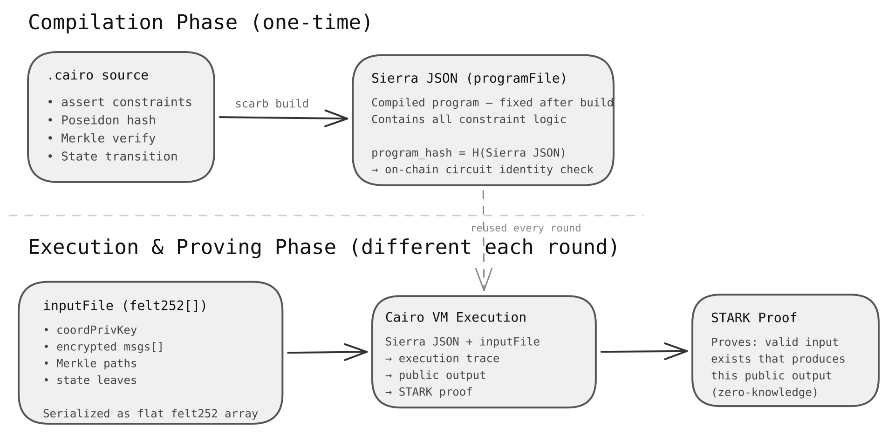

---

## Current Starknet-Native Cryptographic Profile

The current implementation uses a new Starknet-native AMACI protocol profile:

| Module | Current implementation |
| --- | --- |
| Curve | Starknet STARK curve |
| Signature | STARK ECDSA. Cairo constrains the signature equation internally, using an explicit `R` point witness and verifying `s * R == H(command) * G + r * PubKey`, where `r = R.x`. |
| ECDH | STARK curve scalar multiplication. The coordinator private key and message public key derive the shared point inside Cairo. |
| Decryption | STARK curve ElGamal-style point relation plus Poseidon stream constraints. Cairo verifies `decrypted_point + shared == c2`, and constrains encrypted command plaintext fields using a Starknet Poseidon stream derived from the shared point and nonce. |
| Hash / KDF | Starknet Poseidon with domain separation for public input hashes, message hashes, nullifier hashes, signature hashes, encryption streams, and commitments. |
| Public output | Native public output headers are used, including magic, version, circuit id, and hash scheme fields, so on-chain wrapper contracts can identify and bind the output. |

Therefore, the current Cairo programs are not a constraint-by-constraint translation of the Circom circuits. They preserve AMACI's state-machine semantics and commitment-chain design, but the cryptographic primitives have moved from the BabyJubJub / EdDSA / Circom Poseidon path to the Starknet-native path.

## Part 1: AMACI Cairo Circuit Architecture

### What Is a Cairo Circuit?

In this system, "circuit" refers to a provably executable Cairo program. The term is used to align with the circuit concept in traditional ZK systems; in practice, these are Cairo source files and compiled Sierra JSON. Each program receives private witness data as input, executes cryptographic verification logic, and outputs a set of public commitment values. The program is compiled by `scarb build` into Sierra JSON, and the STARK prover generates a proof from the program's execution trace.

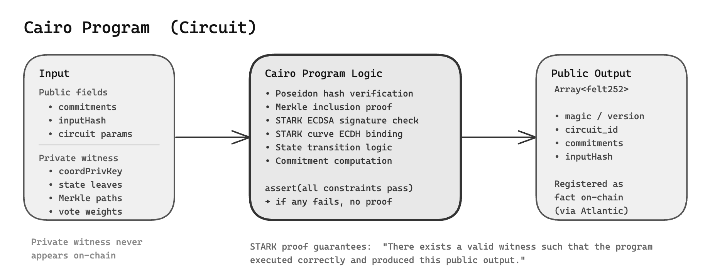

### Circuit Parameters (2-1-1-3)

The current implementation uses a fixed parameter set:

| Parameter | Value | Meaning |
| --- | ---: | --- |
| stateTreeDepth | 2 | 5-ary Merkle tree, 25 state leaves |
| intStateTreeDepth | 1 | Each tally batch processes 5 leaves |
| voteOptionTreeDepth | 1 | Each voter has 5 vote options |
| messageBatchSize | 3 | Each proof batch processes 3 encrypted messages |

### Circuit Families

The system consists of four circuit families, each responsible for one phase of an AMACI round:

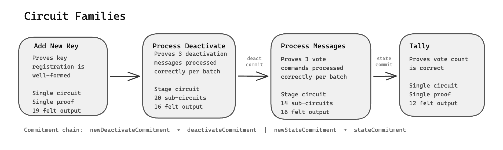

#### 1. Add New Key (`add_new_key_native`)

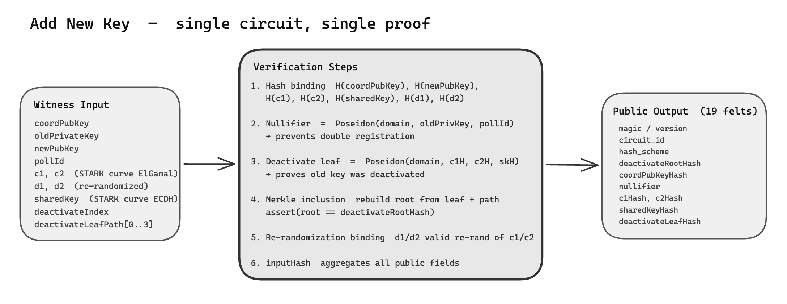

This proves that one user-side key update / re-authorization was processed correctly. The circuit verifies:

- **Old key authorization**: the old private key and public key relationship is correct, and the nullifier is derived from the old private key and poll id to prevent duplicate registration.
- **New key binding**: the new STARK curve public key is included in the new state commitment.
- **Deactivation proof**: the deactivate leaf and Merkle path for the old key are correct, proving that the old key has entered the deactivation set.
- **Re-randomization**: ciphertext related to the old key is bound to a STARK curve ElGamal-style rerandomization.
- **Commitment update**: the circuit outputs a new state commitment and binds the input hash and native public output header.

#### 2. Process Deactivate Messages (`process_deactivate_stage_native`)

This proves that a batch of 3 deactivate messages was processed correctly. For each message, the circuit verifies:

- **ECDH**: a shared point is derived on the STARK curve from the coordinator private key and the message public key.
- **Decryption**: Cairo verifies the STARK curve decrypt point relation, ensuring the encrypted command decrypts to a valid deactivate request.
- **Signature**: the voter's STARK ECDSA signature authorizes the deactivate operation, and the signature equation is constrained inside Cairo.
- **State transition**: the active-state tree and deactivate tree are updated correctly.

**Public output**: current/new deactivate commitments, message hash chain, and state root.

Source files:

| File | Role |
| --- | --- |
| `native_process_deactivate.cairo` | Boundary - batch-level commitment and hash-chain constraints |
| `native_process_deactivate_components.cairo` | Subcomponents - CoordKey / ECDH / Signature / Decrypt |
| `native_process_deactivate_step_core.cairo` | Step Core - state transition for one deactivate message |
| `native_process_deactivate_stage.cairo` | Stage entry - composes all modules and verifies cross-links |

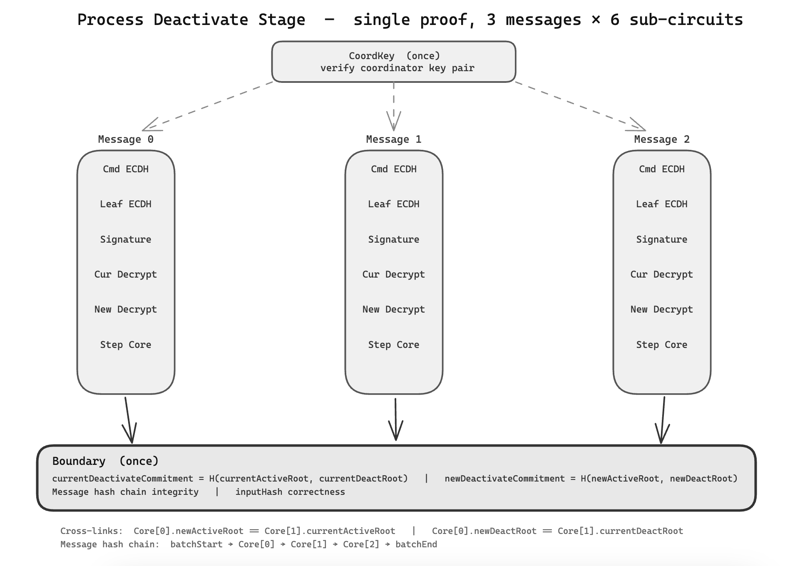

#### 3. Process Vote Messages (`process_messages_stage_native`)

This proves that a batch of 3 vote messages was processed correctly. For each message:

- **ECDH**: a shared point is derived on the STARK curve between the voter's message public key and the coordinator private key.
- **Decryption**: Cairo verifies the STARK curve decrypt point relation and constrains encrypted command plaintext fields with a Starknet Poseidon stream.
- **Signature**: STARK ECDSA signature verification, with Cairo constraining `s * R == H(command) * G + r * PubKey`.
- **State transition**: vote weight, balance, and nonce updates are correct.

**Public output**: current/new state commitments, deactivate commitment, and message hash chain.

Source files:

| File | Role |
| --- | --- |
| `native_process_messages.cairo` | Boundary - batch-level commitment and hash-chain constraints |
| `native_process_message_components.cairo` | Subcomponents - CoordKey / ECDH / Decrypt / Signature |
| `native_process_message_step_core.cairo` | Step Core - full state transition for one message |
| `native_process_messages_stage.cairo` | Stage entry - composes all modules and verifies cross-links |

Complete flow diagram:

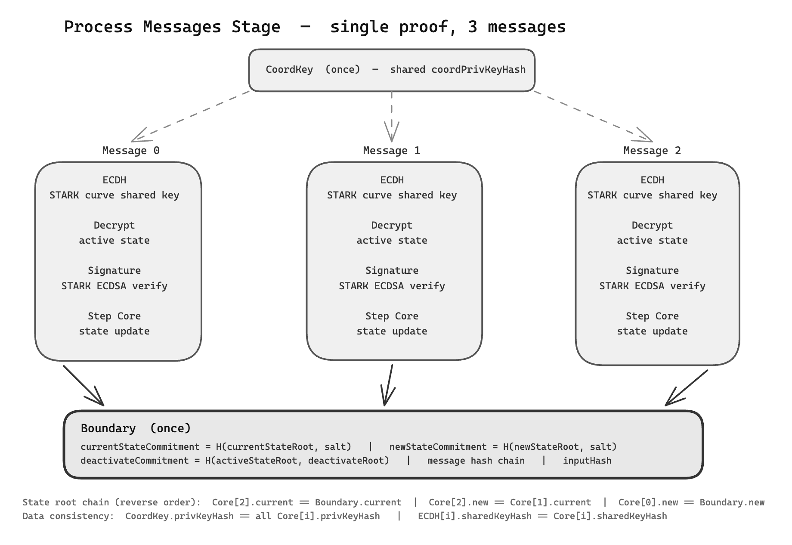

Sub-circuit responsibilities:

| Sub-circuit | Verifies | Input (witness) | Output (public fields) |
| --- | --- | --- | --- |
| CoordKey | Coordinator private/public key pairing | coordPrivKey, coordPubKey | coordPubKeyHash, coordPrivKeyHash |
| ECDH | STARK curve shared point derivation | coordPrivKey, encPubKey, sharedKey | sharedKeyHash, sharedKeyBindingHash |
| Decrypt | STARK curve ciphertext point relation and command decryption | coordPrivKey, c1, c2, decryptedPoint, encryptedCommand | c1Hash, c2Hash, decryptIsOdd, decryptBindingHash |
| Signature | Voter STARK ECDSA signature validity | pubKey, rPoint, s, packedCommand | commandAuthHash, signatureValid |
| Step Core | State transition correctness | stateLeaf, votePath, command params | currentStateRoot, newStateRoot |
| Boundary | Batch commitments and hash chain | stateRoots, salts, msgs | commitments, inputHash |

#### 4. Tally (`tally_votes_native`)

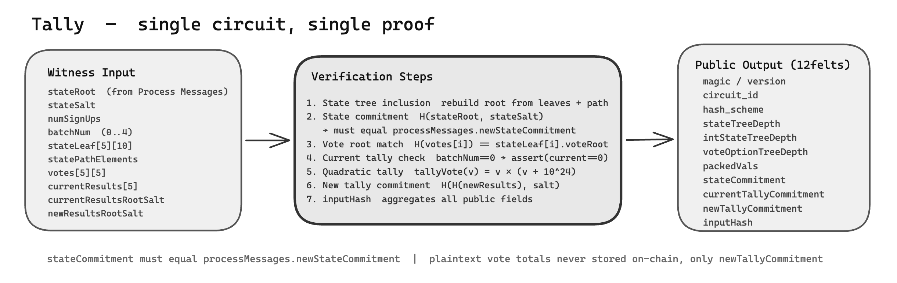

**Key design points:**

- Tally processes voters in batches of 5. This is determined by `intStateTreeDepth = 1`, so 5^1 = 5. Under the 2-1-1-3 parameters, there is only 1 signup, so only batch 0 is needed.
- The `stateCommitment` in the tally output must equal the Process Messages `newStateCommitment`. This is how the commitment chain links the two stages.
- Actual vote totals (plaintext) are never stored on-chain. The chain only stores `newTallyCommitment`. Correctness is guaranteed by the proof.

### No Trusted Setup

Unlike zkSNARK (Groth16) systems, which require a ceremony to generate proving and verification keys, the zkSTARK path does not require a trusted setup. The compiled Cairo program (Sierra JSON) is the main proving artifact. There is no `zkey` and no "toxic waste".

It is important to separate proof-system assumptions from protocol-cryptography assumptions. The STARK proof system itself relies on public assumptions such as hashes/FRI. The AMACI business protocol also relies on the Starknet STARK curve discrete-log assumption, STARK ECDSA security, STARK curve ECDH security, and Starknet Poseidon security in its domain-separated hash/KDF roles.

---

## Part 2: Starknet End-to-End Flow

### Overall Architecture

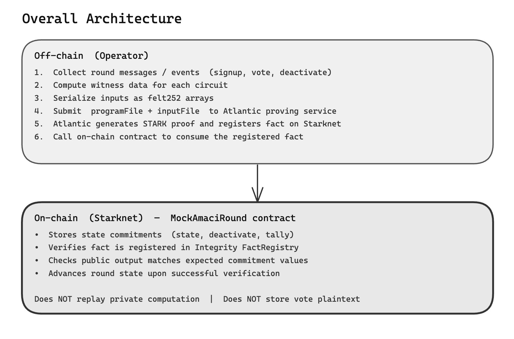

### Proof Generation Pipeline

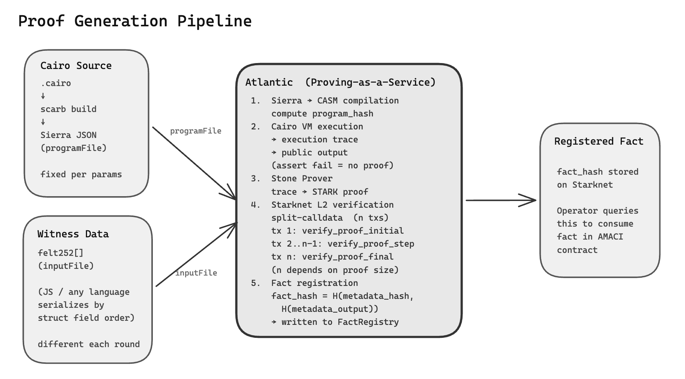

The Operator submits two files to Atlantic:

| File | Content | Analogy |
| --- | --- | --- |
| `programFile` | Compiled Cairo program (Sierra JSON) | "Circuit" - one fixed file per parameter set |
| `inputFile` | Serialized witness + public fields (felt252 array) | "Witness" - different for each round |

In the current Atlantic E2E path, witness data is submitted to Atlantic's execution environment. The proof and on-chain calldata do not contain these private inputs, but the third-party prover service itself is an execution boundary that must be stated explicitly. If production needs a stronger boundary, the Operator can self-host a Stone prover and submit Integrity verification transactions directly.

After receiving these two files, Atlantic executes the following pipeline:

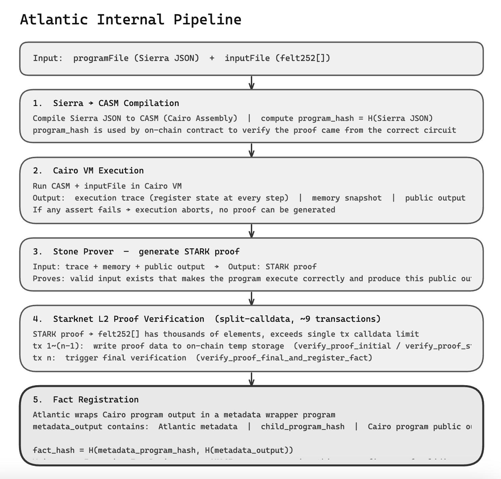

Throughout this process, the Operator's private data (such as `coordPrivKey`) enters Atlantic's execution environment, but does not appear in the proof, FactRegistry, or AMACI business contract state.

### Metadata Wrapper Layer

Atlantic does not directly register the fact for our AMACI program. Instead, it wraps the output with a **metadata wrapper program**. The `metadata_output` contains:

- Atlantic metadata (verification configuration and security parameters)
- `child_program_hash` (the Cairo program's program hash)
- The full Cairo program public output, embedded inside the metadata output

The on-chain registered fact is bound to `H(metadata_program_hash, H(metadata_output))`. When the AMACI contract consumes the fact, it extracts the Cairo program public output from `metadata_output` and verifies the commitments.

**If the Operator runs its own prover in the future**, the metadata wrapper layer is not needed. The Operator can register `H(cairo_program_hash, H(cairo_public_output))` directly. The AMACI contract reserves two entrypoint families:

```text
submit_process_messages_fact(...)                    <- used when the Operator self-runs the prover (direct Cairo output binding)
submit_process_messages_atlantic_metadata_fact(...)  <- used with Atlantic (metadata unwrapping required)
```

### What FactRegistry Stores

FactRegistry **does not store the proof itself**. It stores a verified credential (fact hash):

```text
Proof verification process:
  tx 1..(x-1): submit proof data in batches to the Integrity verifier contract
  tx x:        verifier contract verifies the proof's mathematical correctness
               -> if verification passes, FactRegistry stores:
                  fact_hash = H(program_hash, H(public_output))
               -> the proof data itself is not permanently stored as FactRegistry state

Meaning of one FactRegistry record:
  "The program identified by program_hash did produce this public_output,
   and that execution was verified."

Later queries:
  Anyone can query FactRegistry for verification records for a fact_hash.
  The AMACI contract calls get_all_verifications_for_fact_hash(...)
  to confirm proof validity and checks whether security_bits reaches
  the contract's configured min_security_bits.
```

### Integrity Contract Components (Starknet Sepolia)

Integrity is the on-chain STARK proof verification infrastructure used by Herodotus/Atlantic. It consists of two core contracts:

| Contract | Address (Sepolia) | Role |
| --- | --- | --- |
| **Verifier** | `0x05e529706944049bb2be637a26a4d78b32e554ecaa54d0e608f2fa9f1472c516` | Receives proof data and performs mathematical verification |
| **FactRegistry (Satellite)** | `0x00421cd95f9ddabdd090db74c9429f257cb6bc1ccc339278d1db1de39156676e` | Stores verified fact hashes and provides a query interface |

**Verifier contract methods:**

| Method | Role | Usage |
| --- | --- | --- |
| `verify_proof_initial` | Starts verification and submits the first proof data batch | First split-calldata transaction |
| `verify_proof_step` | Continues submitting proof data; can be called multiple times | Intermediate split-calldata transactions; count depends on proof and calldata size |
| `verify_proof_final` | Submits the last data batch, triggers final verification, and registers the fact | Final split-calldata transaction |
| `verify_proof_full` | Submits and verifies the full proof in one transaction | Shortcut when the proof is small enough |

**FactRegistry query methods:**

| Method | Role |
| --- | --- |
| `get_all_verifications_for_fact_hash(fact_hash)` | Given a fact_hash, returns all verification records, including security_bits and verifier_config |
| `get_verification(verification_hash)` | Given a verification_hash, returns the corresponding verification record, if it exists |

When the AMACI contract queries FactRegistry, it does not simply check whether a fact exists. It checks whether the security level is high enough:

```text
is_fact_hash_valid_with_security(fact_hash, min_security_bits):
  verifications = FactRegistry.get_all_verifications_for_fact_hash(fact_hash)
  for verification in verifications:
    if verification.security_bits >= min_security_bits:
      return true   <- found a verification record that satisfies the security requirement
  return false      <- no qualifying verification record, reject
```

`min_security_bits` is a parameter configured when deploying the AMACI wrapper/round contract. It is not a hardcoded protocol constant. The 2-1-1-3 E2E test described here uses `50`.

**Call flow:**

```text
Atlantic submits proof:
  tx 1:      Verifier.verify_proof_initial(settings, proof_part_1)
  tx 2..n-1: Verifier.verify_proof_step(proof_part_N)
  tx n:      Verifier.verify_proof_final(proof_part_last)
              -> verification passes
              -> Verifier internally calls FactRegistry.register(fact_hash)
              -> emits FactRegistered event

AMACI contract consumes fact:
  MockAmaciRound.submit_xxx_atlantic_metadata_fact(...)
      -> internally queries FactRegistry verification records
      -> a record satisfying min_security_bits exists: update round state
      -> no qualifying record: transaction reverts
```

### Round Lifecycle

A complete AMACI round proceeds in the following order:

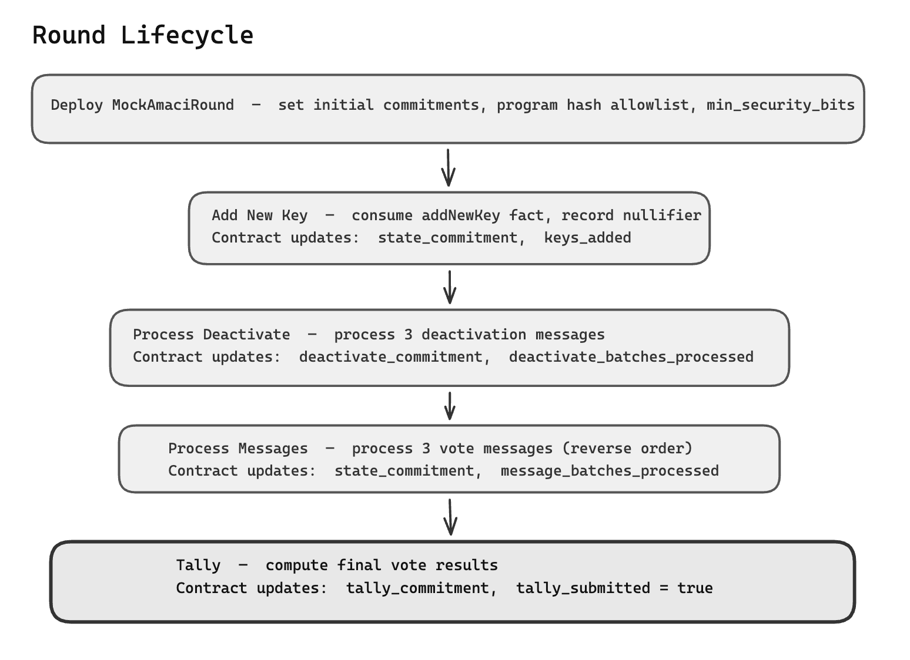

Each proof contains **current** and **new** commitment values in its public output. The on-chain contract enforces continuity:

```text
contract stored commitment == proof current commitment  ->  verification passes
contract stored commitment = proof new commitment        ->  state advances
```

### Commitment Chain (Integrity Guarantee)

The security of the full round is built on the commitment chain. Each proof binds one state transition, and the contract ensures transitions occur sequentially:

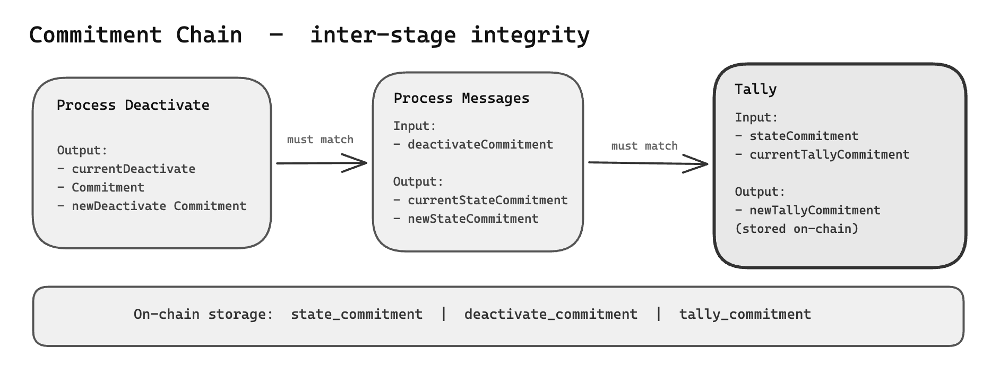

The contract never replays private computation. It only verifies:

1. The fact hash is registered in Integrity FactRegistry
2. The program hash matches the Cairo program allowed for that operation
3. The metadata output's child program hash, native public output header, circuit id, and hash scheme match expectations
4. Key public fields such as commitments, nullifiers, and batch counters match the call parameters
5. Commitment values link to the contract's currently stored state

### On-Chain Contract Role

`MockAmaciRound` is the on-chain state-machine contract for an AMACI round. It does not execute vote processing, signature verification, decryption, or tally logic. All of that computation is done in Cairo programs and proven by zkSTARK. The contract is only responsible for verifying that the proof has been confirmed by Integrity, checking program hash and metadata output bindings, checking state continuity, and advancing the round state.

**Contract storage:**

```text
state_commitment              Current state tree commitment
deactivate_commitment         Current deactivate tree commitment
tally_commitment              Current tally result commitment
keys_added                    Number of accepted key registrations
message_batches_processed     Number of processed vote batches
deactivate_batches_processed  Number of processed deactivate batches
tally_submitted               Whether the final tally has been recorded
allowed_program_hashes        Program hash allowlist for valid Cairo programs
used_key_nullifiers           Consumed nullifier set for replay prevention
```

**Complete contract interaction flow in the E2E round:**

This E2E round uses JS fixtures to simulate user-side and operator-side data generation. It is not a real frontend wallet submission, nor the final product interaction flow for production. Its goal is to run the protocol-level path with deterministic test data: user keys and vote messages are generated locally, the operator submits each stage's Cairo input to Atlantic, Atlantic verifies the proof on Starknet and registers the fact, and finally the `MockAmaciRound` contract deployed on Starknet Sepolia consumes these facts and advances on-chain state.

The actual verification record for this round is located at:

```text
/Users/bun/DoraFactory/maci/zkStark-amaci/target/e2e-round-flow-stark-native-atlantic-postfix2-20260525-223633
```

Full record:

```text
/Users/bun/DoraFactory/maci/zkStark-amaci/e2e-round-2113-resubmit.md
```

Actual deployment and Atlantic queries:

| Item | Value |
| --- | --- |
| MockAmaciRound | `0x0158434ad2308bf2ab25aa05044b326278a137aec2bef092176d56e493a5df1c` |
| deploy tx | `0x05bfa958164907b5c7c2c7e67546c936a98fd214cebeaa5b0b71b8a638d5b122` |
| addNewKey query | `01KSFS206SC3MN3QMD12R08CPM` |
| processDeactivate query | `01KSFS27AJDWWWGQWRKGH6N8XT` |
| processMessages query | `01KSFS2FSSYBNDT57ZD39Y8XWK` |
| tally query | `01KSFS2PTWSP9GGQEDB5Q09H3G` |
| wrapper submits | `4/4 SUCCEEDED` |
| final on-chain state check | `state/deactivate/tally commitments and counters all matched fixture` |

**Role breakdown:**

| Stage | Business role | On-chain submitter | What the contract sees |
| --- | --- | --- | --- |
| addNewKey | User-side key update / re-authorization | operator or relayer can submit | Registered add-new-key fact, nullifier, new state commitment |
| processDeactivate | Operator batch-processes deactivate messages | operator | Registered deactivate fact, old/new deactivate commitment |
| processMessages | Operator batch-processes vote messages | operator | Registered process-message fact, old/new state commitment |
| tally | Operator tallies votes | operator | Registered tally fact, old/new tally commitment |

In the current E2E, all on-chain `sncast` transactions are submitted by the test account. This is only the test execution method and does not change protocol roles. In a real system, users generate and authorize their own keys and vote messages, while the operator collects messages, generates proofs, submits facts, and advances the round.

**Complete flow:**

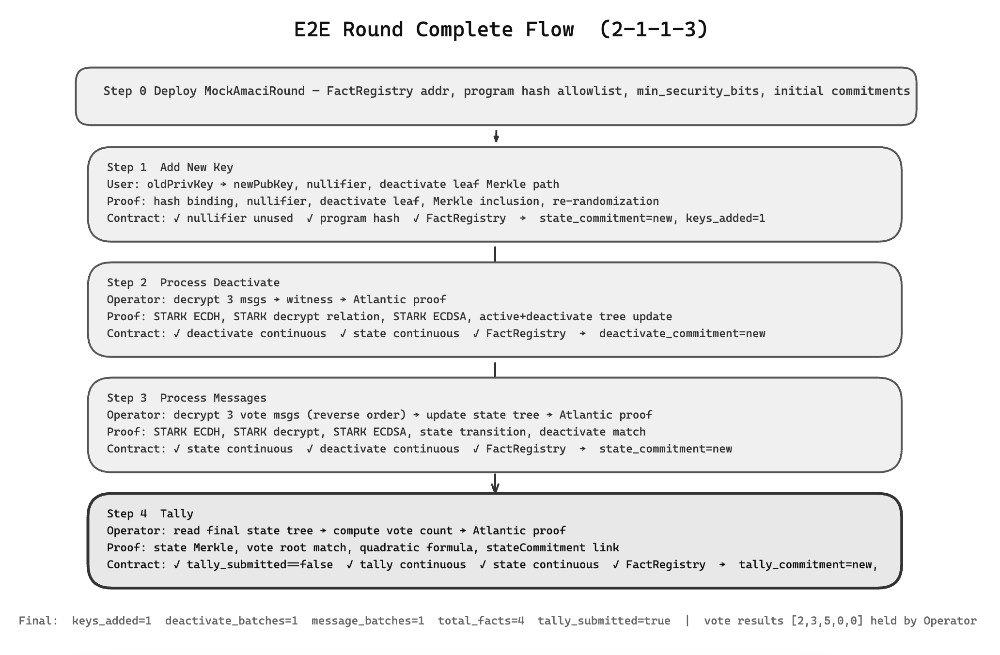

**Core contract design principle:**

The contract never replays private computation. Its verification logic can be summarized as three checks:

```text
1. State continuity: stored commitment == current_commitment in call parameters
2. Proof validity:   FactRegistry contains a corresponding fact with sufficient security_bits
3. Data consistency: program hash, native output header, circuit id, hash scheme,
                     and key public fields == call parameter values
```

All three checks must pass before the contract updates state. Any failure reverts the transaction. This guarantees:

- A state transition discontinuous with the current on-chain commitment cannot be submitted
- A fake proof cannot be submitted, because FactRegistry is queried
- The proof's public output cannot be tampered with, because data consistency is checked

### Comparison with Groth16 AMACI

| Dimension | Groth16 (circom) | zkSTARK (Cairo) |
| --- | --- | --- |
| Trusted setup | Required (Powers of Tau + circuit-specific ceremony) | Not required |
| Circuit language | Circom (R1CS constraints) | Cairo (executable program) |
| Cryptographic primitives | BabyJubJub, EdDSA, Circom Poseidon | STARK curve, STARK ECDSA, Starknet Poseidon |
| Protocol equivalence | Original AMACI / MACI circuit path | Starknet-native AMACI variant; not byte-for-byte equivalent |
| Proof generation | Local execution (rapidsnark) | Atlantic or self-hosted Stone prover |
| On-chain verification | Groth16 verifier contract (~200k gas) | Integrity verifies proof and registers fact; the business contract queries FactRegistry |
| Proof size | ~128 bytes | Larger; submitted by Atlantic to Integrity for verification, while the business contract does not receive the full proof |
| Composability | Limited | Native recursive composition support |

### Summary

This Starknet-native AMACI implementation demonstrates a viable path: decompose AMACI's core state transitions and key cryptographic relations into provably executable Cairo programs, then let Starknet business contracts consume facts that have already been verified in Integrity FactRegistry. The on-chain contract does not replay private computation and does not store vote plaintext. It only checks whether the fact is valid, whether the program hash matches, whether the metadata output is correctly bound, and whether commitments in public output are continuous with the current on-chain state. This keeps complex vote processing, ECDH, decryption, signature verification, and tally logic in provable off-chain execution, while the chain only serves as the state machine and verification entrypoint.

More importantly, the current implementation has switched to the Starknet-native curve system. User public keys, coordinator public keys, ECDH shared points, ElGamal-style ciphertext point relations, and STARK ECDSA signatures are all built on the Starknet STARK curve. Hash/KDF/encryption stream logic uses Starknet Poseidon with domain separation. In other words, the Cairo programs no longer depend on the BabyJubJub / EdDSA / BN254 compatibility path, and they no longer trust operator-supplied signature or decryption validity flags. These cryptographic relations are recomputed or constrained during Cairo execution; if they fail, no fact acceptable by the on-chain contract can be produced.

In this 2-1-1-3 E2E test, the full `signup -> vote -> deactivate -> vote -> processMsg -> tally` lifecycle has been completed: JS fixtures generate deterministic business data and witnesses, Atlantic generates and verifies STARK proofs, facts are registered on Starknet Sepolia, and `MockAmaciRound` consumes the `addNewKey`, `processDeactivate`, `processMessages`, and `tally` facts in sequence. The final on-chain commitment state matches the local fixture. This shows that the current Cairo programs, Atlantic proof path, Integrity fact registration, and AMACI wrapper contract are connected correctly at the protocol level.

The current implementation is still protocol-level and contract-level verification, not the final product form. Atlantic is useful for quickly validating the proof pipeline and cost model, but witness data enters a third-party execution environment. If a stronger execution boundary is required later, the system can switch to a self-hosted Stone prover and submit Integrity verification transactions directly. Next optimization priorities include reducing the number of facts consumed per round, optimizing batch/recursive aggregation strategy, and evolving the current mock round state machine into a production AMACI round contract.
